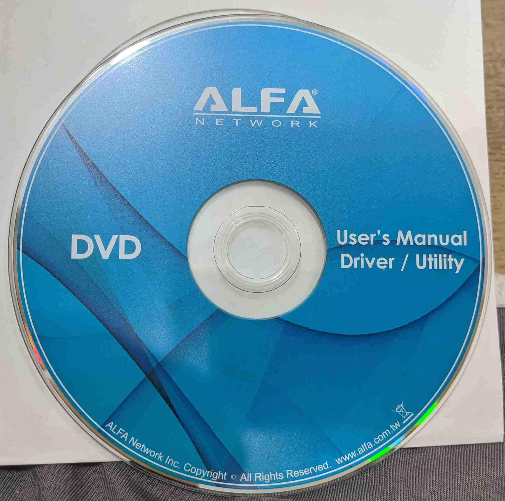
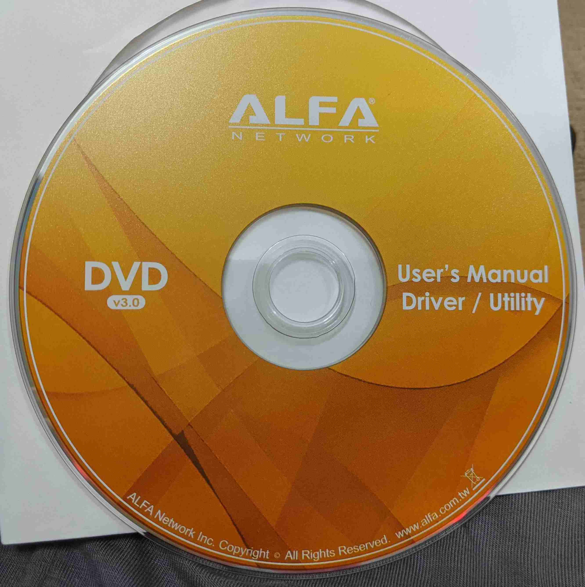
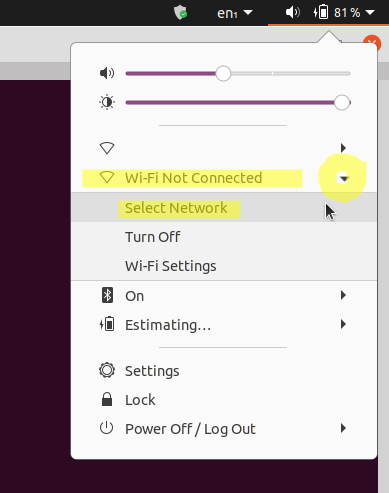

# Repo Status

Ready for use. 

The entire contents of multiple Alfa driver DVDs have been uploaded here, containing Windows, Mac, and Linux drivers for Alfa wifi adapters and products. 


# AlfaWiFiAdapterSoftware

This is the software that comes on the CDs with Alfa WiFi adapters. Since most modern computers don't have CD/DVD drives anymore, I find the CDs to be inconvenient, hence why I'm making this repo.

I'll also add a few of my personal installation notes for these Alfa drivers on Linux Ubuntu, as I figure out how to do it.

By Gabriel Staples  
www.ElectricRCAircraftGuy.com  


# Wiki Instructions

Anyone can edit this [wiki](https://github.com/ElectricRCAircraftGuy/AlfaWiFiAdapterSoftware/wiki) to add your own instructions on how to install whatever Alfa or similar driver on any operating system, whether Windows, Mac, Linux, or something else.


# My Instructions

For my personal notes and driver installation instructions, see this section of the readme, below: ["Driver Installation Instructions on Linux"](#Driver-Installation-Instructions-on-Linux).


# Alfa Driver DVDs

## Disk 1: ALFA_Driver_DVD_old

<a href="ALFA_Driver_DVD_old" title="Click to browse ALFA_Driver_DVD_old files">
         
</a>

- This is the driver installation DVD which came with my [Alfa AWUS036NH 2000mW 2.4GHz USB Wi-Fi adapter for $25 from Rokland here](https://store.rokland.com/products/alfa-awus036nh-802-11n-wireless-n-usb-wi-fi-adapter-2-watt). 
- You can also get it [in this bigger kit for $45 here](https://store.rokland.com/products/alfa-awus036nh-2000mw-usb-wi-fi-luxury-pack-w-6-accessories). 
- It appears to be the older of the two disks.
- Its size is 2.8 GB.
- See its [directory structure here](ALFA_Driver_DVD_tree.md), or browse its files above or by clicking on the data DVD disk image to the right.

## Disk 2: ALFA_Driver_DVD_v3.0 [recommended]

<a href="ALFA_Driver_DVD_v3.0" title="Click to browse ALFA_Driver_DVD_v3.0 files">
         
</a>

- This is the driver installation DVD which came with my [Alfa AWUS036AC 802.11ac Long Range AC1200 Dual Band 2.4GHz/5GHz WiFi USB Dongle for $29 from Rokland here](https://store.rokland.com/products/alfa-awus036ac-802-11ac-long-range-dual-band-wifi-usb-adapter).
- It appears to be the newer of the two disks, and it says "v3.0" on the front of it.
- Its size is 3.0 GB.
- See its [directory structure here](ALFA_Driver_DVD_v3.0_tree.md), or browse its files above or by clicking on the data DVD disk image to the right.

## Disk copy instructions on Linux

References:
1. [my own answer] https://askubuntu.com/questions/17275/how-to-show-the-transfer-progress-and-speed-when-copying-files-with-cp/1275972#1275972
1. https://fideloper.com/user-group-permissions-chmod-apache

Here is how I copied the entire contents of the DVDs above on my Linux Ubuntu computer, FROM directory `/media/gabriel/ALFA Driver DVD` TO directory `~/GS/dev/AlfaWiFiAdapterSoftware`:

```bash
# First, do a dry run to make sure the statistics summary at the end all looks good, and that
# "Number of deleted files" (meaning: files it's going to delete from your destination directory)
# is 0.
time rsync -rah --dry-run --info=progress2 --stats '/media/gabriel/ALFA Driver DVD' ~/GS/dev/AlfaWiFiAdapterSoftware

# When ready, remove the `--dry-run` flag above to actually do the copy. In the event there are any
# disk read errors, simply re-run this command repeatedly until you no longer get any errors and it
# all passes. Any read errors will show up live in the `rsync` terminal output while the command
# runs. If you get read errors, you may need to clean the disk and try again. `rsync` is great in
# that it scans for and only copies changes between source and destination, which makes it as though
# it can pick up where it left off, so re-running the command is usually very fast.
time rsync -rah --info=progress2 --stats '/media/gabriel/ALFA Driver DVD' ~/GS/dev/AlfaWiFiAdapterSoftware

# Once done copying, add (`+`) read/write (`rw`) privileges for your user and group (`ug`) to all
# files you just copied (in the destination directory), like this. This allows you to be able to
# move, modify, rename, etc. them as you see fit using your favorite file manager, such as nemo (my
# favorite; see here for how to install it: https://askubuntu.com/a/1173861/327339) or nautilus (the
# default that comes with Ubuntu).
cd ~/GS/dev/AlfaWiFiAdapterSoftware
chmod -R ug+rw 'ALFA Driver DVD'

```

Here is `--stats` summary I saw after running the command above. It copied 2.98 GB of data in 17 min. 31.65 sec., at an average rate of \~2.83 MB/sec. I used [this external CD/DVD drive which I bought for $27 from Amazon](https://amzn.to/369blHP). It works great! It was plug-and-play on Linux Ubuntu, and required no special setup. I just plugged it into a single USB 3.0 port, from where it drew power as well, and it worked with no problem. 

>     $ time rsync -rah --info=progress2 --stats '/media/gabriel/ALFA Driver DVD' ~/GS/dev/AlfaWiFiAdapterSoftware
>               2.98G 100%    2.71MB/s    0:17:29 (xfr#3920, to-chk=0/4944)   
> 
>     Number of files: 4,944 (reg: 3,920, dir: 1,024)
>     Number of created files: 4,944 (reg: 3,920, dir: 1,024)
>     Number of deleted files: 0
>     Number of regular files transferred: 3,920
>     Total file size: 2.98G bytes
>     Total transferred file size: 2.98G bytes
>     Literal data: 2.98G bytes
>     Matched data: 0 bytes
>     File list size: 65.53K
>     File list generation time: 0.001 seconds
>     File list transfer time: 0.000 seconds
>     Total bytes sent: 2.98G
>     Total bytes received: 81.34K
> 
>     sent 2.98G bytes  received 81.34K bytes  2.83M bytes/sec
>     total size is 2.98G  speedup is 1.00
> 
>     real    17m31.650s
>     user    0m41.922s
>     sys 0m19.801s


# License
ALFA HAS THEIR OWN LICENSES TO COVER THEIR OWN SOFTWARE HEREIN!

Whatever licenses Alfa has on this software is their business. I do not pretend to override their licenses by adding my own licence and license file to this repo. **The license file I've added to this repo is only for the content I add here which is not otherwise bound by any other license by Alfa or anyone else.**


# Driver Installation Instructions on Linux

Here are the drivers I've installed for my use on Linux, and how I installed them. 

1. [Alfa AWUS036NH 2000mW Tx Power 2.4GHz USB Wi-Fi adapter](#AWUS036NH)
1. [Alfa AWUS036AC 802.11ac Long Range AC1200 Dual Band 2.4GHz/5GHz WiFi USB adapter](#AWUS036AC)

<a name="AWUS036NH"></a>
## Alfa AWUS036NH 2000mW Tx Power 2.4GHz USB Wi-Fi adapter

Tested on Ubuntu 20.04. 

**INSTALL DRIVER:**

NA. The device is just plug-and-play on Ubuntu now. You don't have to manually install any driver! 

<a name="AWUS036NH-connect-and-configure"></a>
**CONNECT AND CONFIGURE:**

1. With all external wifi adapters UNPLUGGED, see what the name is of your internal wifi card, so we can disable it to force the computer to use the external wifi USB adapter instead.

    ```bash
    iwconfig

    ```

    Mine shows `enp0s31f6`, `wlan0` (connected to my wifi network ESSID), and `lo`. So, `wlan0` is my internal wifi card.

1. Plug in the external USB adapter, and run `iwconfig` again. I now see a `wlan2` adapter as well. That is my external USB adapter.
1. Disable my internal wifi card (`wlan0` in my case) ([source](https://askubuntu.com/a/204536/327339)):

    ```bash
    # Turn OFF your internal wifi card
    sudo ip link set wlan0 down

    # Note: if you ever need to turn it back on, simply run this:
    # sudo ip link set wlan0 up
    ```

1. Now, manually connect your USB adapter to your wifi network: click the drop-down menu at the top-right of your Ubuntu screen --> click the little arrow next to "Wi-Fi Not Connected" --> choose "Select Network", and connect from there. See the image below:

    <p align="left" width="100%">
         
    </p>

1. Once you've connected, run `iwconfig` again:

    ```bash
    iwconfig
    ```

    You should see that `wlan2` (your external USB wifi adapter) is now connected to your network's ESSID (wifi network name) with `Frequency:2.447 GHz`, since this USB adapter works on 2.4GHz only. `wlan0` (your internal wifi card) should NOT be connected to anything now. Also take a look at your key connection information in the `iwconfig` output to see the quality of your connection, such as the following:

    >     Frequency:2.447 GHz
    >     Bit Rate=72.2 Mb/s   Tx-Power=30 dBm
    >     Link Quality=70/70  Signal level=-19 dBm  

    A bit rate of 72.2 Mb/sec is normal for this adapter, and a link quality of 70/70 with a signal level of -19 dBm is pretty much _perfect._ You can't get much better than that! Higher numbers are better. A really weak signal might look like `Quality=39/70  Signal level=-71 dBm`. To scan for all possible networks to connect to, run:

    ```bash
    iwlist wlan2 scanning
    ```

    And, to search specifically just for your ESSID for your network, filter that output with this command (source: see [my comment under this answer here](https://askubuntu.com/a/261410/327339)):

    ```bash
    iwlist wlan2 scanning | grep -C5 -i 'my_network_name'
    ```

1. You may now go to https://speedtest.net to run a speed test to verify the speed of your connection, or use their [`speedtest` CLI tool](https://www.speedtest.net/apps/cli) from the command-line:

    ```bash
    speedtest
    ```

    Good speeds for this Alfa AWUS036NH 2.4GHz USB wifi adapter are **\~5\~13 Mbps download** and **\~10\~20 Mbps upload**. It is NOT a high-speed adapter. Instead, it is a **high power** (2000mW Tx power--highest on the market!--even today in the year 2020, despite it being made originally in like 2011 or something!) and **long range** wifi adapter! That's what its specialties are: high transmit power and long range, NOT high speed!
1. Done!


_Notes to self:_

You don't need to do this below anymore, since Ubuntu comes with driver support for this Realtek `RT chipset 3070, rev 0201` now. (See `dmesg` output after plugging in this Wifi adapter to see that it is the 3070 chipset).

References:

1. https://askubuntu.com/questions/148767/how-do-i-install-the-ralink-rt3070-wireless-driver/148786#148786

        sudo apt update
        sudo apt install build-essential flex bison
        tar -xjvf 2011_0719_RT3070_RT3370_RT5370_RT5372_Linux_STA_V2.5.0.3_DPO.bz2
        cd 2011_0719_RT3070_RT3370_RT5370_RT5372_Linux_STA_V2.5.0.3_DPO


<a name="AWUS036AC"></a>
## Alfa AWUS036AC 802.11ac Long Range AC1200 Dual Band 2.4GHz/5GHz WiFi USB adapter

**INSTALL DRIVER:**

With the device NOT plugged in, do:

    sudo apt update
    sudo apt install build-essential git dkms libelf-dev linux-headers-`uname -r`
    mkdir ~/Downloads/Install_Files/wifi
    cd ~/Downloads/Install_Files/wifi
    time git clone https://github.com/aircrack-ng/rtl8812au.git
    cd rtl8812au
    time sudo ./dkms-install.sh

Now reboot.

Done! Now jump to ["Connect and Configure" below](#AWUS036AC-connect-and-configure).


Sample commands to this wifi adapter:

```bash
# turn device OFF (set interface down)
sudo ip link set wlan0 down
# turn device ON (set interface up)
sudo ip link set wlan0 up 
```

NB: per the link below, do NOT use the below commands on this device. Use the commands above instead.
```bash
sudo ifconfig wlan0 down  # do NOT use; use `sudo ip link set wlan0 down` instead
sudo ifconfig wlan0 up    # do NOT use; use `sudo ip link set wlan0 up` instead
```

For more info. and commands, see here: https://github.com/aircrack-ng/rtl8812au/tree/v5.6.4.2.


_Notes to self:_

1. Driver from Alfa won't build; seems to be an incompatibility issue with Linux kernels more recent than like 5 years ago.

            tar -xvf AWUS036AC_036EAC_ACH_linux_v4.3.2_11100.20140411.tar
            cd AWUS036AC_036EAC_ACH_linux_v4.3.2_11100.20140411
            make
    
    FAILS TO BUILD! See my build errors here: https://github.com/gnab/rtl8812au/issues/207

1. The Alfa AWUS036AC is here: https://www.alfa.com.tw/products_detail/3.htm
    1. It uses the "Realtek RTL8812AU" chipset, so that's what I need to install drivers for!
1. Sample google searches:
    1. ["AWUS036AC_036EAC_ACH_linux_v4.3.2_11100.20140411 no member named 'data'"](https://www.google.com/search?q=AWUS036AC_036EAC_ACH_linux_v4.3.2_11100.20140411+no+member+named+%27data%27&oq=AWUS036AC_036EAC_ACH_linux_v4.3.2_11100.20140411+no+member+named+%27data%27&aqs=chrome..69i57.5501j0j7&sourceid=chrome&ie=UTF-8)
    1. ["Realtek RTL8812AU linux driver install github"](https://www.google.com/search?sxsrf=ALeKk03aDsMOuB81JNWFUQQ0CZwigxtoqA%3A1601354945491&ei=wbxyX9y9HYTSsAXSiZL4DQ&q=Realtek+RTL8812AU+linux+driver+install+github&oq=Realtek+RTL8812AU+linux+driver+install+github&gs_lcp=CgZwc3ktYWIQAzIHCCEQChCgATIHCCEQChCgATIFCCEQqwIyBQghEKsCOg4IABCwAxCKAxC3AxDlAjoHCCMQrgIQJzoFCCEQoAFQl-UnWMvpJ2CA6ydoAnAAeAGAAcoCiAHBCZIBBzAuMi4yLjGYAQCgAQGqAQdnd3Mtd2l6yAEKuAECwAEB&sclient=psy-ab&ved=0ahUKEwicor2FyI3sAhUEKawKHdKEBN8Q4dUDCA0&uact=5)
1. Sample driver repos for this chipset (ealtek RTL8812AU):
    1. ***** [1114 commits; active 9 days ago; has tons of versions; seems to be the most up-to-date] https://github.com/aircrack-ng/rtl8812au
    1. https://github.com/gordboy/rtl8812au-5.6.4.2
    1. **** https://github.com/gnab/rtl8812au
        1. Issue I opened: https://github.com/gnab/rtl8812au/issues/207
    1. ***** [2352 commits; active 13 days ago] https://github.com/ulli-kroll/rtl8821au


<a name="AWUS036AC-connect-and-configure"></a>
**CONNECT AND CONFIGURE:**

See and follow the ["Connect and Configure" instructions](#AWUS036NH-connect-and-configure) for the "AWUS036NH" adapter above. 


----

Disclaimer required by Amazon:  
_We are a participant in the Amazon Services LLC Associates Program, an affiliate advertising program designed to provide a means for us to earn fees by linking to Amazon.com and affiliated sites._
